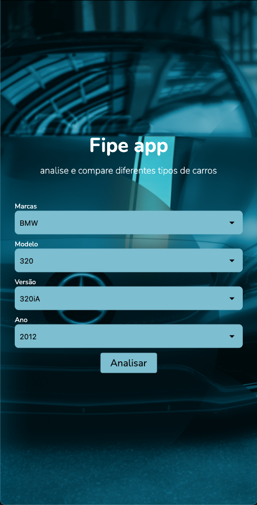
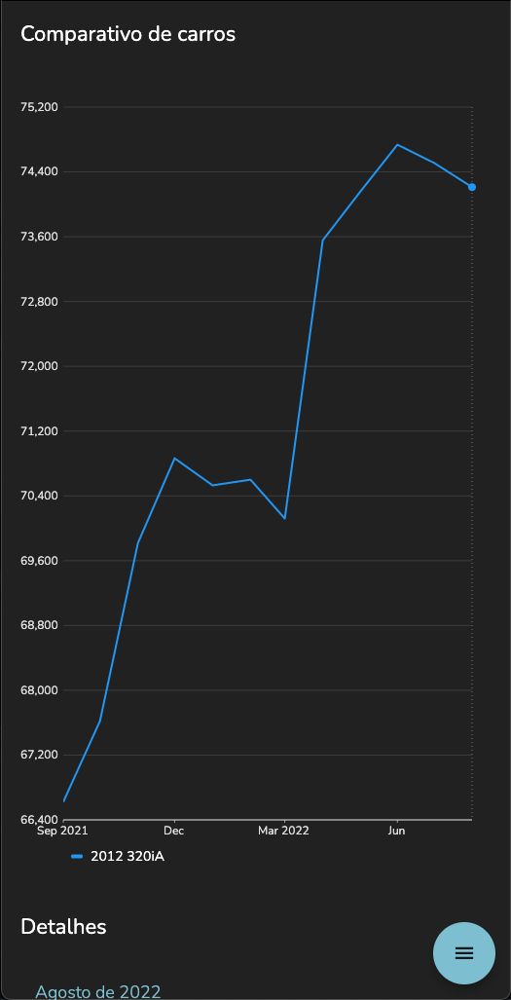
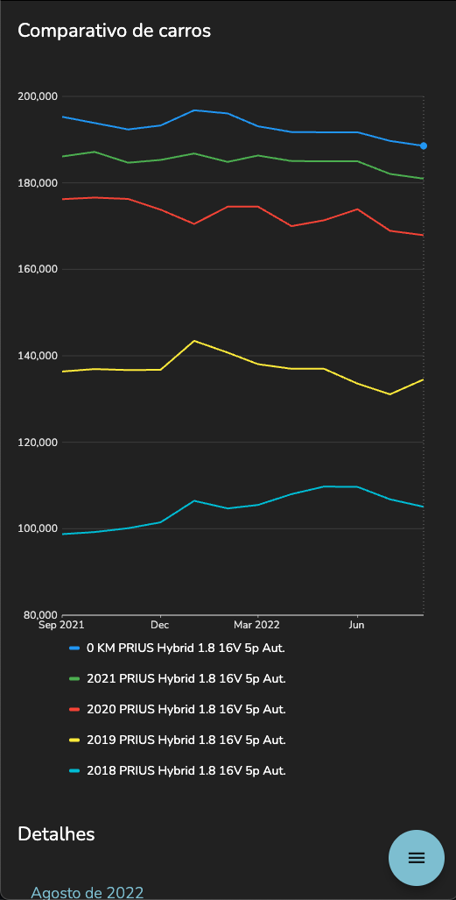
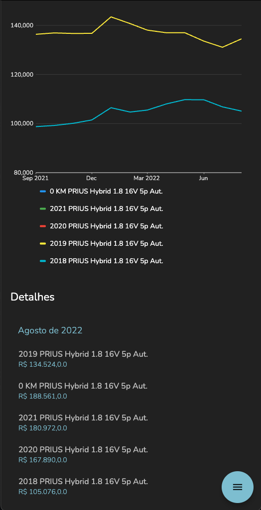

  

<samp><h6 align="center">#android, #car, #flutter</h6></samp>
<samp><h1 align="center">FIPE app</h1></samp>

  
  

This is an application case to make comparisons between cars of different brands and years in graph format in a period of 12 months (1 year) through the API of Cenário Capital LTDA.

> ### ⚠️ Attention
> 
> - The API is NOT officially declared as a public API, so there are restrictions on using it, so use it sparingly.
> - The use of the API is not being done through exposure, hacking, bypass and/or improper access, it is just being done because it has no blocks and also because it is simply consultable.
> - The elaboration of the project is solely and strictly for the purposes of studies and learning without commercial or appropriation purposes as the project license reacts.
> - This repository has no link with FIPE and is intended to be just informative, if you have any questions, visit http://veiculos.fipe.org.br/

 

## Photos

### Main page

On this page it is possible to choose the year, model and brand of a car

<kbd></kbd>
 

### One car chart

This will show a graph of the value within 12 months of a car

<kbd></kdb>
 

### Multiple cars charts

In this one it will be similar to the previous one but with several cars

<kbd></kdb>
 

### Details

At the end of the page, the details of a specific month will be shown, which can be changed by clicking on the graph

<kbd></kdb>
 

